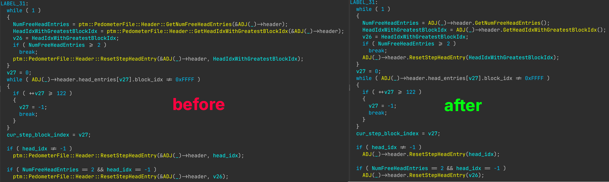

# Hex-Rays C++ Reformatter

This plugin reformats the pseudocode output from Hex-Rays IDA Pro for non-virtual C++ function calls.



It works by taking the pseudocode output as-is from the decompiler, and restructuring the call expression to more closely resemble what the source form of the expression would've looked like (or at least, as close as possible).

For example, turning:
```cpp
v24 = MyNamespace::MyClass::MyFunction(&object);
```
into:
```cpp
v24 = object.MyFunction();
```
In many cases, this will improve readability greatly, especially when functions are grouped using many namespaces in their name.

The plugin automatically enables reformatting for supported calls, but it is possible to toggle it on or off using `Edit -> Plugins -> C++ function call reformatter`.

## Features:
- **No IDB/ctree modification**. This plugin **only** changes the pseudocode *text* before it is rendered.
- Retaining navigation and cross-reference features for the function and the call object (`this`), e.g. it is still possible to navigate to `MyNamespace::MyClass::MyFunction`, as well as to cross-reference it with other calls in the current and other functions in the program.
- Usage of correct call operator (`->` for pointers, `.` otherwise) based on the type of `this`.
- Reformatting decision based on (demangled) function name and call object (`this`) type, e.g. `this` must be `MyNamespace::MyClass` (or a pointer to it) in order to reformat a call to `MyNamespace::MyClass::MyFunction`.
- Support for inheritance, e.g. in cases where `class MyParent : MyBase` and a `MyParent` instance is used to call a non-virtual function that is part of `MyBase`. (proper struct definitions are required in order to detect inheritance).
- Detection of casts, in bad cases of stack reuse, by rewriting the expression to still look somewhat readable
- Support for multi-line function call expressions, as is the case when there are many parameters / parameters with long labels.

## TODO:
- Add support for struct returns (return by value), as in these cases, `this` becomes the second argument

## Installation
This plugin has been designed for and tested with IDA Pro version 9.2.250908. Older versions are unsupported and may not work.

Builds are provided for Linux (x64) and Windows (x64) in the Releases section.

Simply copy the .so or .dll file (depending on your OS) into `plugins` in your IDA installation directory.

## Building
Use the [IDA C++ SDK](https://github.com/HexRaysSA/ida-sdk) to build the plugin.